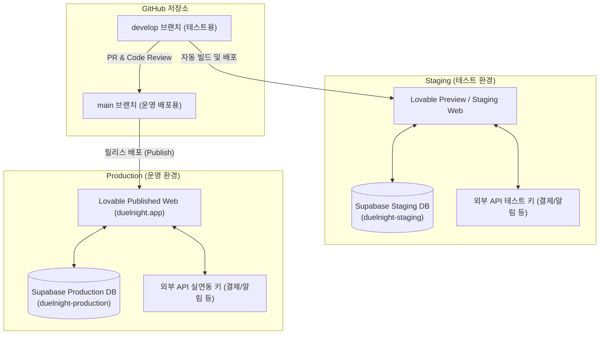

# 개발·테스트·운영 환경 격리 및 배포 아키텍처 기획서
> **추후 정식 서비스 런칭 직전 단계에서 백엔드(Supabase) 및 인프라를 안전하게 격리하고 이중화하기 위한 가이드라인 및 기획 문서입니다.**

---

## 1. 개요 및 목적

현재 DuelNight 프로젝트는 단일 백엔드(Supabase)를 공유하며 프론트엔드 레벨에서만 Preview(테스트)와 Published(운영)를 분리하여 운영하고 있습니다. 개발 초기 단계에서는 이 방식이 속도 면에서 매우 효율적이지만, 실제 사용자의 데이터가 축적되는 **정식 운영 단계**에서는 데이터 보호 및 안전한 기능 검증을 위해 백엔드까지 완전히 분리된 독립 환경이 필수적입니다.

### 🎯 격리 운영의 기대 효과
* **안전한 데이터 격리**: 테스터들이 테스트 결제, 회원 탈퇴, 데이터 임의 삭제 등을 진행해도 실제 사용자 데이터에 전혀 영향을 주지 않습니다.
* **리스크 없는 DB 마이그레이션**: 데이터베이스 테이블 구조 변경(Schema Migration)을 테스트 서버에서 먼저 수행 및 검증한 뒤 안전하게 운영 서버에 반영할 수 있습니다.
* **인프라 독립성**: 테스트용 외부 API 키(예: 토스페이먼츠 테스트 키)와 실제 결제용 API 키를 환경별로 완벽히 격리하여 사고를 방지합니다.

---

## 2. 대상 아키텍처 (Target Architecture)

Staging(테스트) 환경과 Production(운영) 환경을 물리적으로 완전히 단절시키는 이중화 격리 구조입니다.

---

## 3. 인프라 및 환경 변수 구성 상세

물리적으로 분리된 2개의 Supabase 프로젝트를 생성하고, 환경별로 환경 변수(Secrets)를 다르게 매핑하여 빌드 시점에 주입되도록 합니다.

### 📋 환경별 세팅 정보 테이블

| 구분 | Staging (테스트 환경) | Production (운영 환경) |
| :--- | :--- | :--- |
| **Supabase Project** | `duelnight-staging` | `duelnight-production` |
| **대표 도메인 URL** | `id-preview--...lovable.app` (또는 `staging.duelnight.app`) | `duelnight.app` (실사용 도메인) |
| **DB 스키마 변경** | 즉시 반영 및 파괴적 테스트 가능 | 검증 완료된 마이그레이션만 배포 프로세스를 통해 순차 적용 |
| **`SUPABASE_URL`** | `https://staging-project.supabase.co` | `https://production-project.supabase.co` |
| **외부 결제 모듈** | 테스트 상점 아이디 및 테스트 키 주입 | 실운영 상점 아이디 및 라이브 키 주입 |
| **환경 식별 배너** | 활성화 (화면 상단 노란색 배너 상시 노출) | 비활성화 (일반 유저에게 노출 안 함) |

---

## 4. Git 브랜치 전략 (Branching Strategy)

협업 가이드 문서(`docs/COLLABORATION_GUIDE.md`)의 규칙을 준수하되, 환경 분리를 지원하기 위해 Git-Flow 모델을 단순화하여 적용합니다.

### 🔄 배포 및 작업 흐름
1. **기능 개발 (`feature/*` 브랜치)**:
   * 개발자는 개별 기능 구현 시 `feature/i18n`과 같이 브랜치를 생성하여 작업합니다.
2. **테스트 통합 및 QA (`develop` 브랜치)**:
   * 기능이 완료되면 `develop` 브랜치로 Pull Request를 보냅니다.
   * `develop` 브랜치에 머지되는 즉시 **Staging(테스트용) 환경**으로 배포됩니다.
   * 테스터와 운영진은 Staging URL에서 마음껏 동작 테스트를 수행하고 버그를 사전에 수정합니다.
3. **실운영 릴리스 (`main` 브랜치)**:
   * Staging 환경에서 버그 수정 및 QA가 최종 완료되면, `develop` 브랜치를 `main` 브랜치로 머지하는 PR을 생성합니다.
   * `main` 브랜치 머지 후 Lovable 콘솔에서 **Publish** 버튼을 클릭하여 **Production(실운영 환경)**으로 최종 배포를 실행합니다.

---

## 5. 단계별 마이그레이션 실행 로드맵 (Migration Roadmap)

나중에 환경 분리 기획을 실제로 실행에 옮길 때, 다음 순서에 따라 작업을 진행하면 안전하게 인프라를 이전할 수 있습니다.

### 📍 Step 1: 신규 Supabase 프로젝트 생성 및 구조 복제
1. Supabase 콘솔에서 실운영용 `duelnight-production` 프로젝트를 새로 만듭니다.
2. 기존 Supabase 프로젝트(Staging으로 전환될 프로젝트)의 데이터베이스 스키마와 테이블 구조를 백업(`pg_dump` 또는 Supabase DB 백업 기능 사용)합니다.
3. 백업한 스키마 구조(SQL 파일)를 새 운영용 프로젝트(`duelnight-production`)에 임포트하여 테이블과 인덱스, 트리거 등을 완벽히 동일하게 구축합니다. *(※ 이때 기존 테스트 데이터는 제외하고 스키마 구조만 복제합니다.)*

### 📍 Step 2: Lovable 및 환경 변수 설정 이중화
1. 프론트엔드 프로젝트(Vite/Lovable) 설정의 `Secrets` 메뉴로 이동합니다.
2. Staging용 배포 타겟과 Production용 배포 타겟의 환경 변수를 나누어 등록합니다.
   * 예: `VITE_STAGING_SUPABASE_URL`, `VITE_STAGING_SUPABASE_ANON_KEY`
   * 예: `VITE_PROD_SUPABASE_URL`, `VITE_PROD_SUPABASE_ANON_KEY`
3. 소스코드 내의 API 초기화 로직(`src/integrations/supabase/client.ts`)에서, 현재 호스트 도메인(또는 빌드 타겟 변수)을 감지하여 올바른 Supabase 클라이언트를 동적으로 반환하도록 수정합니다.

### 📍 Step 3: 외부 연동 서비스(결제, 알림 등) 이중화
1. 결제 대행사(PG) 또는 토스페이먼츠 콘솔에서 **실제 운영용 상점 아이디(MID)**와 **Live API Key**를 발급받습니다.
2. Production 환경 변수 영역에 Live 키를 주입하고, Staging 환경 변수 영역에는 기존의 Test 키가 유지되도록 설정합니다.

### 📍 Step 4: 데이터베이스 마이그레이션 프로세스 확립
1. 앞으로의 DB 변경 사항은 항상 로컬에서 검증한 뒤 Staging DB에 먼저 적용하여 테스트합니다.
2. Staging에서 완벽히 검증된 테이블 변경 SQL 파일만 순차적으로 운영 DB(`duelnight-production`)에 적용하고 프론트엔드를 배포합니다.

---

## 6. 결론 및 유의 사항

현재는 서비스가 프로토타입 단계이며 활성 사용자가 없으므로, **이 기획 문서를 바탕으로 개발 프로세스를 이어가시다가 정식 런칭 1~2주 전에 위 로드맵(5장)의 단계를 밟아 격리 작업을 수행하시는 것이 가장 효율적**입니다. 

그 전까지는 현재 구축되어 있는 **"노란색 테스트 배너"**와 **"Lovable 2단계 배포(Preview → Publish) 규칙"**을 가이드라인 삼아 안전하고 기민하게 개발을 진행하시면 됩니다.
